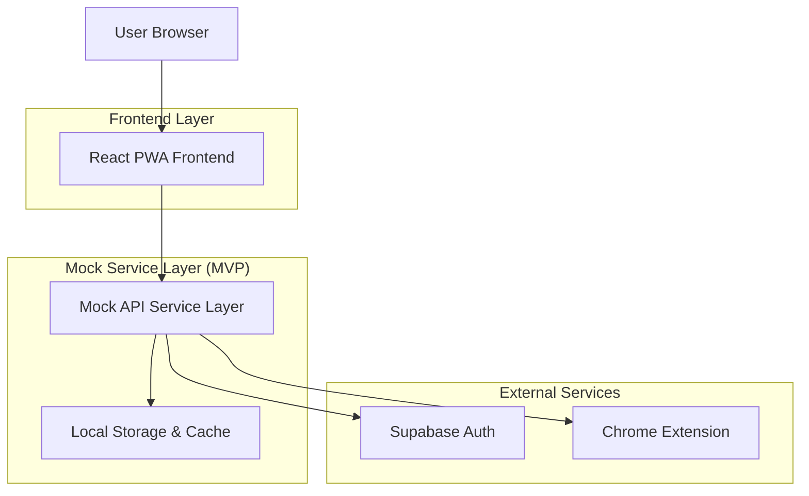
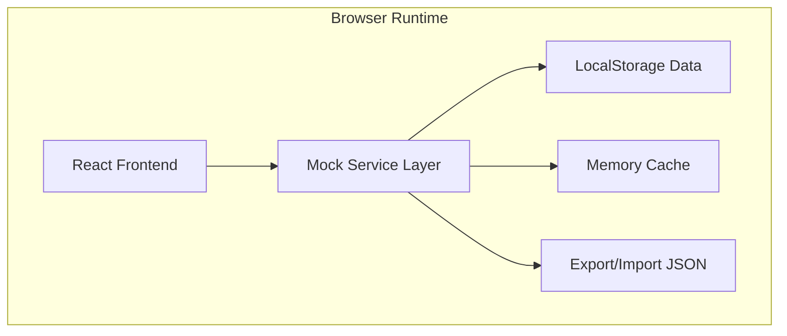

## 1. 架构设计



## 2. 技术描述

* 前端：React\@18 + Vite + PWA + TailwindCSS\@3

* 初始化工具：vite-init

* 后端：无独立后端（MVP阶段在前端实现Mock Service Layer）

* 认证：Supabase Auth（仅登录态，无数据库）

* 状态管理：React Context + SWR（本地缓存模拟数据）

* 插件：Chrome Extension（Manifest V3），与主站共用UI组件库

## 3. 路由定义

| 路由         | 用途                  |
| ---------- | ------------------- |
| /login     | 登录页，支持邮箱/密码与Token复用 |
| /products  | 产品搜索与选择，支持关键词与筛选    |
| /quotation | 报价配置与实时预览           |
| /suppliers | 供应商管理与成本文件上传        |
| /history   | 历史报价记录查看            |

## 4. API定义（Mock阶段）

### 4.1 成本价相关

**UploadCostFile**\
`POST /api/cost/upload`\
Request（FormData）：

| 参数名                   | 类型     | 必需 | 描述        |
| --------------------- | ------ | -- | --------- |
| supplier\_profile\_id | string | 是  | 供应商ID     |
| file                  | File   | 是  | 标准Excel文件 |

Response：

```json
{
  "status": "success",
  "parsed_items_count": 120,
  "error_messages": []
}
```

**GetCostItems**\
`GET /api/cost/items?supplier_profile_id=xxx&page=1&size=20`\
Response：

```json
{
  "items": [
    {
      "product_id": "DHD360",
      "internal_code": "DHD360-H",
      "cost_price": 20000,
      "currency": "CNY",
      "effective_date": "2025-01-01"
    }
  ],
  "total": 120
}
```

### 4.2 报价引擎

**GenerateQuotation**\
`POST /api/quotation/generate`\
Request：

```json
{
  "products": [
    { "product_id": "DHD360", "quantity": 1 }
  ],
  "margin_ratio": 0.2,
  "exchange_rate": 7.0,
  "customer_id": "可选"
}
```

Response：

```json
{
  "quotation_id": "q_123",
  "items": [
    {
      "product_id": "DHD360",
      "name": "DHD360 hammer",
      "specs_summary": "3 1/2 AR pin",
      "unit_price": 3429,
      "quantity": 1,
      "amount": 3429,
      "currency": "USD"
    }
  ],
  "total_amount": 3429,
  "currency": "USD",
  "generated_at": "2025-01-29T12:00:00Z"
}
```

### 4.3 产品参数

**SearchProducts**\
`GET /api/products/search?keyword=DHD&supplier=xxx`\
Response：

```json
{
  "products": [
    {
      "product_id": "DHD360",
      "name": "DHD360 hammer",
      "specs": "3 1/2 AR pin",
      "has_cost": true
    }
  ]
}
```

**GetProductSpecs**\
`GET /api/products/DHD360/specs`\
Response：

```json
{
  "product_name": "DHD360 hammer",
  "description": "潜孔锤",
  "technical_specs": {
    "螺纹": "3 1/2 AR pin",
    "重量": "25kg"
  },
  "attachments": [
    { "name": "技术图纸.pdf", "url": "/files/xxx.pdf" }
  ]
}
```

## 5. 服务端架构（Mock实现）



Mock Service职责：

* 解析上传的Excel（使用SheetJS在前端解析）

* 将解析结果存入LocalStorage模拟数据库

* 根据margin与汇率实时计算报价

* 提供JSON导出/导入功能，便于后续迁移到真实后端

## 6. 数据模型

### 6.1 实体关系

```mermaid
erDiagram
  SUPPLIER ||--o{ COST_ITEM : provides
  COST_ITEM ||--o{ QUOTATION_ITEM : quoted
  PRODUCT ||--o{ COST_ITEM : has
  PRODUCT ||--o{ QUOTATION_ITEM : included

  SUPPLIER {
    string id PK
    string name
    string contact
    string updated_at
  }
  PRODUCT {
    string id PK
    string name
    string specs
    string category
  }
  COST_ITEM {
    string id PK
    string supplier_id FK
    string product_id FK
    int cost_price
    string currency
    string effective_date
  }
  QUOTATION {
    string id PK
    string customer_id
    float margin_ratio
    float exchange_rate
    string generated_at
  }
  QUOTATION_ITEM {
    string id PK
    string quotation_id FK
    string product_id FK
    int quantity
    float unit_price
    string currency
  }
```



### 6.2 本地DDL（Mock阶段使用LocalStorage结构）

**Supplier 示例结构**

```json
{
  "supplier_id": "s_001",
  "name": "黑金刚",
  "contact": "sales@xxx.com",
  "created_at": "2025-01-01T00:00:00Z"
}
```

**CostItem 示例结构**

```json
{
  "cost_item_id": "ci_123",
  "supplier_id": "s_001",
  "product_id": "DHD360",
  "cost_price": 20000,
  "currency": "CNY",
  "effective_date": "2025-01-01"
}
```

**Quotation 示例结构**

```json
{
  "quotation_id": "q_456",
  "customer_id": "c_789",
  "margin_ratio": 0.2,
  "exchange_rate": 7.0,
  "total_usd": 3429,
  "generated_at": "2025-01-29T12:00:00Z",
  "items": [
    {
      "product_id": "DHD360",
      "quantity": 1,
      "unit_usd": 3429
    }
  ]
}
```

## 7. 浏览器插件集成

插件Manifest V3配置：

* 侧边栏注入：content script在页面右侧插入iframe，加载`https://app.xxx.com/plugin`路由

* 共享登录态：通过chrome.storage.sync共享token，与主站同步登录状态

* 报价插入：调用`document.execCommand('insertText', false, markdownTable)`将报价表格插入当前输入框

* 产品搜索：复用主站`/api/products/search`接口，结果缓存5分钟

插件使用流程：

1. 用户在Gmail回复邮件 → 点击插件图标唤醒侧边栏
2. 侧边栏内搜索产品 → 选择并设置margin/汇率
3. 点击"插入报价" → 将Markdown表格写入邮件正文光标处
4. 关闭侧边栏，继续编辑邮件

## 8. 部署与迁移策略

MVP阶段：

* 前端静态部署至Vercel/Netlify，启用PWA与HTTPS

* 所有API走前端Mock，数据存储在浏览器LocalStorage，支持导出JSON备份

* 插件打包后上传Chrome Web Store，指向线上地址

后续迁移：

* 保留Mock Service接口不变，将其实现为真实后端（Node/Supabase）

* 通过环境变量切换`REACT_APP_API_URL`，无缝迁移已有数据与功能

* 插件无需改动，仅需更新CORS与域名白

