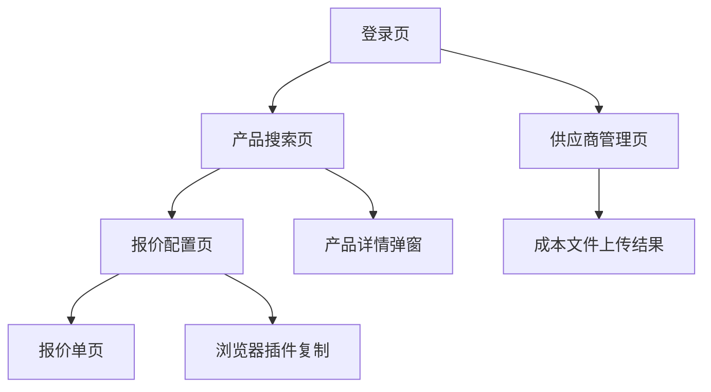

## 1. 产品概述
设计一个以Web/SaaS为核心、浏览器插件为辅助的ERP报价与产品参数管理系统，实现供应商成本数据标准化、客户统一报价逻辑、产品参数集中管理，并通过插件在多场景快速生成报价。

目标用户为内部销售与授权员工，解决报价效率低、数据分散、缺乏统一标准的问题，提升报价准确性与响应速度。

## 2. 核心功能

### 2.1 用户角色
| 角色 | 注册方式 | 核心权限 |
|------|----------|----------|
| 授权用户 | 管理员邀请 | 上传成本文件、生成报价、查看全部数据 |
| 普通用户 | 邮箱注册 | 查看产品参数、生成报价（只读成本） |

### 2.2 功能模块
系统包含以下核心页面：
1. **登录页**：用户认证、角色权限校验。
2. **供应商管理页**：供应商Profile维护、成本文件上传、解析结果查看。
3. **产品搜索页**：关键词搜索、分类筛选、快速选择产品。
4. **报价配置页**：选择产品、设置margin与汇率、实时预览报价。
5. **报价单页**：生成正式报价单、导出/复制、查看历史。
6. **产品详情弹窗**：技术参数、文档链接、成本与报价历史。

### 2.3 页面详情
| 页面名称 | 模块名称 | 功能描述 |
|----------|----------|----------|
| 登录页 | 用户认证 | 输入邮箱与密码登录，支持Token复用供插件调用。 |
| 供应商管理页 | 供应商Profile | 列表展示供应商名称、联系人、更新时间；点击可查看已上传成本文件记录。 |
| 供应商管理页 | 成本文件上传 | 选择供应商后上传Excel，系统解析并回显解析条数与错误信息。 |
| 产品搜索页 | 搜索栏 | 顶部搜索框支持关键词、供应商、分类筛选；实时联想产品名称。 |
| 产品搜索页 | 产品列表 | 卡片展示产品名称、规格、是否有有效成本价；点击选中进入报价配置。 |
| 报价配置页 | 产品选择 | 左侧已选产品列表，支持数量编辑、删除；右侧实时计算区。 |
| 报价配置页 | Margin与汇率 | 下拉选择预设模板或手动输入margin、汇率；实时刷新报价。 |
| 报价配置页 | 报价预览 | 悬浮窗展示每条产品销售价、小计、总计；支持一键复制表格。 |
| 报价单页 | 正式报价单 | 生成带公司抬头、客户信息、产品明细、合计金额的正式报价单；支持导出PDF。 |
| 产品详情弹窗 | 技术参数 | 弹出层展示产品基本信息、螺纹、尺寸、重量等结构化字段。 |
| 产品详情弹窗 | 附件与历史 | 提供技术文档下载链接；展示历次成本价与报价记录。 |

## 3. 核心流程

### 成本价数据流（授权用户）
授权用户进入供应商管理页 → 选择供应商Profile → 上传标准Excel → 系统解析 → 成功后刷新成本列表 → 审计记录上传行为。

### 报价数据流（所有用户）
用户在产品搜索页选择产品 → 进入报价配置页 → 设置margin/汇率 → 实时调用报价引擎 → 悬浮窗预览 → 生成正式报价单或复制表格到剪贴板。

### 产品参数查看（所有用户）
在产品列表点击产品名称 → 弹出详情弹窗 → 调用产品参数服务 → 展示技术参数与附件链接。

## 4. 用户界面设计

### 4.1 设计风格
- 主色：#1976D2（Material Blue 700），强调色：#4CAF50（Green 500）。
- 按钮：圆角4px，扁平化，主按钮实心蓝底白字，次按钮白底蓝框。
- 字体：Roboto 14px正文，16px标题，12px辅助信息。
- 布局：卡片式列表，顶部通栏搜索栏，底部悬浮操作区。
- 图标：使用Material Icons，搜索用放大镜，报价用货币符号，参数用信息圆圈。

### 4.2 页面设计概览
| 页面名称 | 模块名称 | UI元素 |
|----------|----------|--------|
| 产品搜索页 | 搜索栏 | 顶部通栏，白底，蓝边框输入框，左侧放大镜图标，右侧筛选下拉。 |
| 产品搜索页 | 产品卡片 | 白色圆角卡片，阴影1dp，标题16px深灰，规格12px浅灰，成本价标签蓝底白字。 |
| 报价配置页 | 悬浮预览窗 | 底部固定，圆角8dp，半透明蓝灰背景，白字，显示总计与复制按钮。 |
| 供应商管理页 | 上传区域 | 拖放区虚线边框，蓝绿色，上传中显示线性进度条，解析结果用绿色对勾或红色警告。 |
| 产品详情弹窗 | 参数表格 | 两栏布局，左侧字段名12px浅灰，右侧值14px深灰，分隔线1dp浅灰。 |

### 4.3 响应式与PWA
采用移动优先的PWA设计，主视图在375px宽度下完全适配，支持添加到主屏与离线缓存关键页面。触摸区域最小48px，滑动返回与下拉刷新均优化。

### 4.4 浏览器插件场景
插件以侧边栏形式注入任意网页，UI风格与主站一致，支持拖拽调整位置。报价结果以Markdown表格格式插入邮件或IM输入框，兼容Gmail、Outlook Web、WhatsApp Web等主流服务。